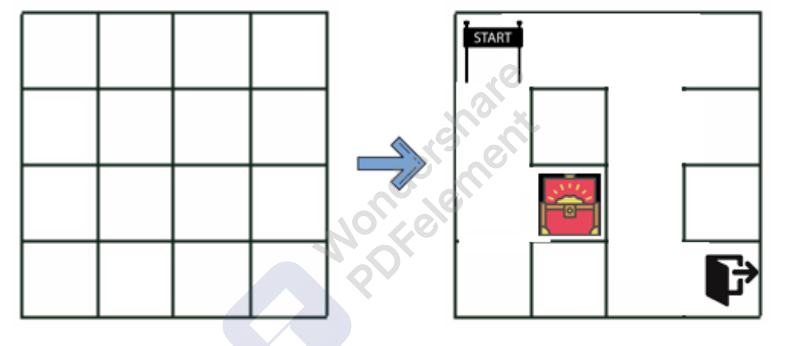

<div id="top"></div>
<!--
*** Thanks for checking out the Best-README-Template. If you have a suggestion
*** that would make this better, please fork the repo and create a pull request
*** or simply open an issue with the tag "enhancement".
*** Don't forget to give the project a star!
*** Thanks again! Now go create something AMAZING! :D
-->


<!-- PROJECT SHIELDS -->
<!--
*** I'm using markdown "reference style" links for readability.
*** Reference links are enclosed in brackets [ ] instead of parentheses ( ).
*** See the bottom of this document for the declaration of the reference variables
*** for contributors-url, forks-url, etc. This is an optional, concise syntax you may use.
*** https://www.markdownguide.org/basic-syntax/#reference-style-links
-->

[@Linkedin](https://www.linkedin.com/in/ahmet-celebi-973b63197/)


<!-- PROJECT LOGO -->
<br />
<div align="center">
  <a href="https://github.com/AmT42/map_generator">
    
  </a>

<h3 align="center">Q-learning maze generator IA</h3>

  <p align="left">
    The goal of the project is to create an algorithm capable of generating an infinite number of 4x4 mazes, but not  any algorithm. Indeed, we will use reinforcement learning, more precisely the Q-learning algorithm to generate different levels of maps. This is where the difficulty of this project lies. In the game design literature, it is common to use the BFS or DFS algorithm to generate a maze and/or use reinforcement learning to solve it, but I have only found one article that talks about reinforcement learning for generating maze  <a href="https://arxiv.org/pdf/2001.09212.pdf"><i>(Ahmed Khalifa, Philip Bontrager & al. PCGRL: Procedural Content Generation via Reinforcement Learning 2021).</i></a> According to the authors : <i>"To the best of our knowledge, this is the first time reinforcement learning is broughtto bear on this problem. This is probably because it is not immediately obvious how to cast a level generation problem as a reinforcement learning problem".</i>  
<p align ="left">This is exactly where the challenge lies. A common practice for a programmer, when we have a coding project that we have never encountered before, is, after reading and understanding the project, to do some research in google, stackoverflow etc. We are not reinventing the wheel, it is important to not waste time on mistakes already made by programmers who have worked on this type of project before us, and this gives us more information, more understanding of possible future problems. Personally, I never worked on a real RL project before that, I only had some theoretical notions from my master's degree, so naturally, as a programmer who knows his best practices , I googled "RL to generate a map" :). After some research, I found the article I mentioned above, it's a very interesting paper, it gaves me some ideas about the training process, the reward function, etc.. but this was the only article that talked about RL to generate a map and their project was quite different in some important aspects so I couldn't really help myself with that.</p>
<p align="left">I knew then I'd have to "invent the wheel". I started by reading articles and theoretical papers on RL to understand how it works in depth.Also I bought two very good courses on udemys from teachers well known for their pedagogy, the first one is the famous cours of <a href="https://www.udemy.com/course/deep-reinforcement-learning-in-python/"><i>Lazy programmer</i></a> and the second comes from <a href="https://www.udemy.com/course/deep-q-learning-from-paper-to-code/"><i>Phil Tabor</i></a>. This is a very good starting point for those interested in reinforcement learning.</p>
<p align="left">After taking these theoretical and practical courses on reinforcement learning, I felt ready to start my project. Quickly, I was confronted with some problems: What are the optimal actions space, the state space and so on ? Thus began the headaches. The instructions was to use Q learning but I figured out that I was going to have almost 1e10 elements in my Q-table and this was just impossible to manage so I had to think of another way. My first idea was to use DeepQ-learning but the instructions were to use Q-learning and since I have never used DeepQN, I didn't want to complicate the task. Then I thought of reducing the dimensionality by using symetry and grouping similar states. At this moment an new Idea came to my mine, hash table ! During my blockchain startup experience, hashing was ubiquitous, so I worked a lot with hash functions and dictionaries.  I'm pretty sure the Idea came from here.<p>
 
<p align=left>To summurize : </p> <p align =left>there is 24 binary editable walls Either there are here or there are not => 2^24 possible combinaisons of wall.</p>
   <p align =left>There are 16 boxes, either empty or filled with one of the three key points = > 16P3 = 3360 possible combinaisons  of box.</p>
   <p align =left>I decided to use a actions space with 11 actions : addStart,AddEnd,addTreasure,EditTopwall,EditBotwall,EditEastWall,EditWestWall,goUp,goBot,goLeft,goriht (the actions are self-explanatory).</p>
  <p align =left>The agent has random initiale position in the matrix with 16 box 
  <p align=left> We end up with almost 2^24 * 3360 * 11 * 16 possibles states </p>
  <p align=left> Solution? Instead of using a Q_table, use a Q_hash (with Q dict) where we store only the visited states. We also use a hash to store our state with python given hash fucntions:
  we store it in self.state : hash(self.maze_map, self.start,self.end,self.treasure, self.ix,self.iy) where maze_map is the state of our maze, start,end,treasure are the locations of your key points, self.ix and self.iy are the locations of my agent in the matrix.
  When we have the state, if it's a New state, We initialize : Q[self.state] = [0] * len of actions space (=11 in our case). After setting up our Q_hash we just have to use belleman equation and Q learning temporal difference to udapte our Q_hash.
  </p>
  <p align = left>Actually our algorithm does not really generate an infinite number of maze since we always give the same maze at the beginning with all the walls that are closed,
only the position of the agent at the beggening differ froms one game to an other and there is only 16 possibles differents starting location for the agent.
Thus, our AI generates only a small number of different maze given our algorithm. But this is not a problem, we just need to make some modifications to have an "infinite" number of maze.
One solution could be to randomly select a starting state in Q_hash.keys() (we can only start with a state already visited). </p>
<p align = left> This IA most of time gives good enough maze but sometime they are pretty "bad". To improve this we can "play" with the parameters of your game like the gamma factor, discount factor, the number of games played, the number of step by game etc..
But I think to make the algorithm much better it's to reduce the len of space states to 10 000 or 20 000 states using symetry or similarity detection. Maybe DeepQN could gives better result too since he handle by himself the curse of dimensionality </p>

</div>
 <p>Belleman equation</p>
  
 <p>Updating Q with temporal difference</p>
  
## About The Project

 `AmT42`, `map_generator`, `ahmet-celebi-973b63197`, `Ahmet_Celebi@hotmail.fr`, `Q-learning map generator`,


<!-- GETTING STARTED -->
## Getting Started

This is an example of how you may give instructions on setting up your project locally.
To get a local copy up and running follow these simple example steps.

### Installation


1. Clone the repo
   ```sh
   git clone https://github.com/AmT42/map_generator.git
   ```
2. launches the bat file : map_generator_run_script, you must have anaconda env otherwise you'll have to run by yourself the scrip in the .py file map_generator_script

3. a text file will appear (maze_sample.txt) copy past here : <a href="https://maze-generator-ui-6ilczt3k5-eikix.vercel.app/"><i>Graphic Interphace</i></a> the first element which is a sample of our matrix e.g. :
  {'(0, 0)': {'E': '0', 'W': '0', 'N': '0', 'S': '0'}, '(0, 1)': {'E': '0', 'W': '0', 'N': '0', 'S': '0'}, '(0, 2)': {'E': '0', 'W': '0', 'N': '0', 'S': '0'}, '(0, 3)': {'E': '0', 'W': '0', 'N': '0', 'S': '0'}, '(1, 0)': {'E': '0', 'W': '0', 'N': '0', 'S': '0'}, '(1, 1)': {'E': '0', 'W': '0', 'N': '0', 'S': '0'}, '(1, 2)': {'E': '0', 'W': '0', 'N': '0', 'S': '0'}, '(1, 3)': {'E': '0', 'W': '0', 'N': '0', 'S': '0'}, '(2, 0)': {'E': '0', 'W': '0', 'N': '1', 'S': '0'}, '(2, 1)': {'E': '0', 'W': '0', 'N': '1', 'S': '0'}, '(2, 2)': {'E': '0', 'W': '0', 'N': '1', 'S': '0'}, '(2, 3)': {'E': '0', 'W': '0', 'N': '1', 'S': '0'}, '(3, 0)': {'E': '1', 'W': '0', 'N': '0', 'S': '1'}, '(3, 1)': {'E': '1', 'W': '1', 'N': '0', 'S': '1'}, '(3, 2)': {'E': '1', 'W': '1', 'N': '0', 'S': '1'}, '(3, 3)': {'E': '0', 'W': '1', 'N': '0', 'S': '1'}}
  the last 3 elements are the location of the starting, ending and trasure point e.g. : (3, 2), (3, 0), (3, 3). and you'll have to add it manually in the Graphic Interphace site
  Some other .svg files will appear in your folder direction e.g. maze(2,2) it's one example of a maze generated by the IA but the keypoints aren't displayed

<!-- USAGE EXAMPLES -->
## Usage

Use this space to show useful examples of how a project can be used. Additional screenshots, code examples and demos work well in this space. You may also link to more resources.

_For more examples, please refer to the [Documentation](https://example.com)_

<p align="right">(<a href="#top">back to top</a>)</p>


<!-- CONTRIBUTING -->
## Contributing

Contributions are what make the open source community such an amazing place to learn, inspire, and create. Any contributions you make are **greatly appreciated**.

If you have a suggestion that would make this better, please fork the repo and create a pull request. You can also simply open an issue with the tag "enhancement".
Don't forget to give the project a star! Thanks again!

1. Fork the Project
2. Create your Feature Branch (`git checkout -b feature/AmazingFeature`)
3. Commit your Changes (`git commit -m 'Add some AmazingFeature'`)
4. Push to the Branch (`git push origin feature/AmazingFeature`)
5. Open a Pull Request

<p align="right">(<a href="#top">back to top</a>)</p>


<!-- LICENSE -->
## License


<!-- CONTACT -->
## Contact

Ahmet CELEBI - [@Linkedin](https://www.linkedin.com/in/ahmet-celebi-973b63197/) - Ahmet_celebi@hotmail.fr

Project Link: [https://github.com/AmT42/map_generator](https://github.com/AmT42/map_generator)


<!-- ACKNOWLEDGMENTS -->
## Acknowledgments

* [Hector Roussille](https://www.linkedin.com/in/hectorroussille/)
* [Philip Bontrager]
* [Ahmed Akhalifa]

<p align="right">(<a href="#top">back to top</a>)</p>

